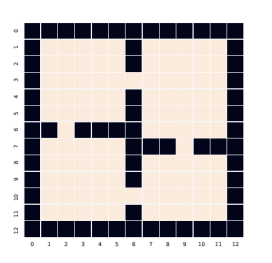

# General Description

Welcome to FourRooms, a simple Reinforcement Learning project featuring the classic Four Rooms environment. In this project, you can explore various scenarios and test Reinforcement Learning agent's capabilities.

In this project, the RL agents are taught to pickup packages on a grid-world. The environment is called the Four-Rooms domain, an environment commonly used to test the efficacy of RL Algorithms. Q-learning is implemented to the RL aglorithm with the goal of teaching the agent to pickup the package(s) in three scenarios of increasing complexity. General information about this project and the Scenarios can be found below:

1. The environment is a 2D grid-world of size 13 x 13 but rows 0 and 12 and columns 0 and 12 are boundaries (not traversable) so it is technically a grid-world of size 11 x 11. The environment has one start state that is randomly assigned when the environment is created and a terminal state that is determined when the number of packages left to collect reaches 0.

2. The agents will only have a partial representation of the environment which consists of their location (x, y) and the number of packages left k. They are not allowed to know the location of the package(s), hallways (cells that connect two rooms together) or the boundaries of the environment. They must figure that out themselves.

3. The agent has four actions: {UP, DOWN, LEFT, RIGHT}. Depending on the scenario flags used, these actions may be deterministic or stochastic. If the actions are stochastic, every action the agent takes may result in a unexpected state to state transition occurring (this is handled by FourRooms.py).

4. There is a suitable reward function for each scenario such that the agents produce the expected behaviour for each scenario. I have also experimented with different learning rates and discount factors and see which values work best for my Agents.

6. The goal of the Agent is to derive an optimal policy such that it collects all of the packages in the environment in accordance with each scenario description.

# Scenario 1: Package Finder
Train a reinforcement learning agent to locate a single package in the environment.

### Run Scenario
make run1

# Scenario 2: Package Fetcher
Teach your RL agent to fetch three packages from a grid-based environment.

## Run Scenario
make run2

# Scenario 3: Color Sequence
Guide an agent to find three packages in the order of red, green, and blue.

## Run Scenario
make run3

# Make
To build and install all the requirement use command: "make" 

# Progress Display
While the agent is training, you will see progress updates in the terminal, displaying the current epoch out of the total number of epochs:

Training... (X / N) epochs

Here, N represents the total number of epochs to train, and X shows the current epoch the agent is being trained within.

Enjoy exploring the FourRooms environment and developing your reinforcement learning agent!